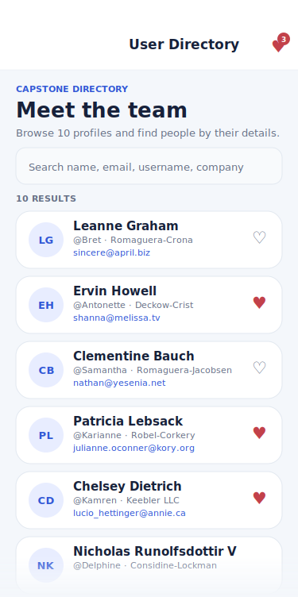
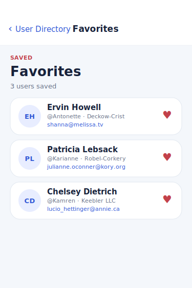
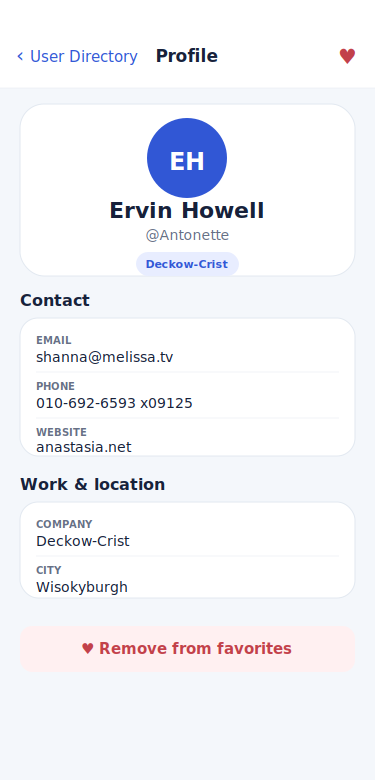

# React and React Native Fundamentals

A 30-day, self-directed learning series covering React for the web and React Native with Expo — built to be portfolio-ready and beginner-friendly.

Each day has its own folder, README, and runnable project. Days 1–7 focus on React web. Days 8–27 cover React Native with Expo. Days 28–30 deliver a TypeScript capstone app.

---

## Screenshots

<p align="center">
  
  &nbsp;&nbsp;
  
  &nbsp;&nbsp;
  
</p>

---

## Skills Demonstrated

- React function components, hooks, and composition patterns
- React Native with Expo: navigation, lists, forms, API calls
- Custom hooks for data fetching, filtering, and persistence
- Context API for global state (favorites, theme)
- AsyncStorage for local persistence across sessions
- TypeScript: interfaces, generics, `as const`, strict mode
- Production folder architecture: screens / hooks / services / storage / utils / theme
- Reusable design system: color tokens, spacing scale, radius scale, shadow presets
- Loading, error, and empty states with retry
- Search and filter with `useMemo`
- React Navigation native stack with typed params

---

## Repository Structure

```text
day-01-modern-javascript/
day-02-react-web-vite/
day-03-react-state-events/
day-04-useeffect-lifecycle/
day-05-controlled-inputs/
day-06-lifting-state-up/
day-07-component-composition/
day-08-react-native-expo/
day-09-rn-state-interactions/
day-10-rn-flatlist/
day-11-rn-navigation/
day-12-rn-search-filter/
day-13-rn-api-fetch/
day-14-rn-ui-states/
day-15-rn-custom-hooks/
day-16-rn-context-api/
day-17-rn-asyncstorage/
day-18-rn-forms-validation/
day-19-rn-navigation-params/
day-20-rn-user-directory/
day-21-rn-performance/
day-22-rn-pagination-refresh/
day-23-rn-production-architecture/
day-24-rn-testing-basics/
day-25-rn-debugging-devtools/
day-26-rn-design-system/
day-27-rn-typescript/
day-28-capstone-start/
day-29-capstone-polish/
day-30-capstone-release/
```

---

## How to Run Any Day

**React web days (Days 01–07):**

```bash
cd day-02-react-web-vite
npm install
npm run dev
```

**React Native / Expo days (Days 08–29):**

```bash
cd day-13-rn-api-fetch
npm install
npx expo start
```

Scan the QR code with **Expo Go** on iOS or Android, or press `i` for the iOS Simulator.

**Type check (Days 27–29):**

```bash
npm run typecheck
```

---

## Final Capstone (Days 28–29)

The capstone is a fully typed **User Directory** app with two passes:

| | Day 28 — Start | Day 29 — Polish |
|---|---|---|
| Data | Fetch from JSONPlaceholder | Same |
| Navigation | Native stack (List → Detail) | + Favorites screen |
| Search | Name / email / company filter | Same |
| UI states | Loading, error, empty | Same + flexible props |
| Favorites | None | Toggle ♥ on every card and detail |
| Persistence | None | AsyncStorage — survives restarts |
| Components | UserCard, SearchBar, states | + AppButton, AppCard, FavoriteButton |
| Theme | colors, spacing, typography | + radii, shadows, lineHeights, success/warning |

**Run the polished capstone:**

```bash
cd day-29-capstone-polish
npm install
npx expo start
```

---

## Course Progress

- [x] Day 01: Modern JavaScript — `const`/`let`, arrow functions, destructuring, `async/await`, modules
- [x] Day 02: React Web with Vite — JSX, components, props, Vite dev server
- [x] Day 03: React State and Events — `useState`, event handlers, re-render cycle
- [x] Day 04: `useEffect` and Lifecycle — side effects, dependency array, cleanup
- [x] Day 05: Controlled Inputs — controlled vs uncontrolled, form state
- [x] Day 06: Lifting State Up — shared state via common parent
- [x] Day 07: Component Composition — `children` prop, slot patterns, reusable primitives
- [x] Day 08: React Native with Expo — `View`, `Text`, `StyleSheet`, Expo Go setup
- [x] Day 09: React Native State and Interactions — `Pressable`, `useState` in RN
- [x] Day 10: React Native Lists with `FlatList` — virtualised lists, `keyExtractor`, `renderItem`
- [x] Day 11: React Native Navigation — native stack, `createNativeStackNavigator`
- [x] Day 12: React Native Search & Filter — `TextInput`, `useMemo` filter
- [x] Day 13: React Native API Calls — `fetch`, `useEffect` async pattern, cleanup
- [x] Day 14: Loading, Error & Empty States — `ActivityIndicator`, reusable state components
- [x] Day 15: Custom Hooks — extracting reusable logic into `useX` functions
- [x] Day 16: Context API & Global State — `createContext`, `Provider`, `useContext`
- [x] Day 17: AsyncStorage & Local Persistence — `getItem`/`setItem`, JSON serialisation
- [x] Day 18: React Native Forms & Validation — input validation, error messages
- [x] Day 19: Navigation & Route Params — typed `RootStackParamList`, `route.params`
- [x] Day 20: Mini Project — User Directory App (Days 08–19 combined)
- [x] Day 21: React Native Performance — `React.memo`, `useCallback`, `useMemo`, FlatList tuning
- [x] Day 22: Pagination & Pull-to-Refresh — `onEndReached`, `refreshing`, page-based fetch
- [x] Day 23: Production Folder Architecture — screens / hooks / services / utils split
- [x] Day 24: Testing Basics with Jest — `describe`/`it`/`expect`, pure function tests
- [x] Day 25: Debugging & DevTools — React DevTools, Flipper, error boundaries
- [x] Day 26: Styling & Design System — token-based theme, reusable component library
- [x] Day 27: TypeScript for React Native — interfaces, generics, `as const`, strict mode
- [x] Day 28: Capstone Start — typed models, hooks, navigation, fetch, search, UI states
- [x] Day 29: Capstone Polish — favorites, AsyncStorage, AppButton, AppCard, richer theme
- [x] Day 30: Capstone Release & Portfolio Summary — docs, architecture, interview prep
