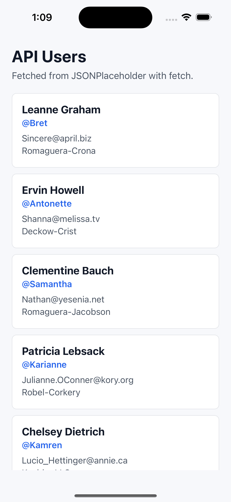

# Day 13: React Native API Calls with fetch

This day builds a simple React Native screen that loads users from a public API.

## Concepts Covered

- Expo blank app
- `useEffect` for an initial API call
- `fetch`
- `async` / `await`
- Loading, error, and data state
- Retry button on error
- `FlatList`
- Pull-to-refresh with `refreshing` and `onRefresh`
- Basic `StyleSheet` styling

## API Used

```text
https://jsonplaceholder.typicode.com/users
```

## Key Learning

API-driven screens usually track three main states:

- loading: the request is in progress
- error: the request failed
- data: the request succeeded and returned results

The retry button calls the same fetch function as the first load, which keeps the data flow simple and beginner-friendly.

## Output



## Project Structure

```text
day-13-rn-api-fetch/
├── App.js
├── app.json
├── index.js
├── package.json
├── screenshots/
│   └── day-13-output.png
└── README.md
```

## How to Run

```bash
npm install
npx expo start
```

Use Expo Go on a device, or press `i`/`a` in the Expo terminal to launch an available simulator or emulator.
